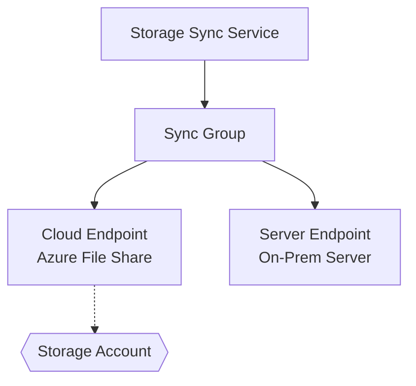

# Azure File Share Report Script (Enhanced with Mermaid Diagrams)

## Overview
This enhanced PowerShell script generates a comprehensive report on all Azure File Shares in your subscription(s), including:
- File Share details (name, storage account, resource group, location, tier, quota)
- **Backup Status** - Whether the file share is protected by Azure Backup
- **Sync Status** - Whether the file share is part of Azure File Sync
- **Mermaid Topology Diagrams** - Visual representation of Storage Sync architecture

## What's New in the Enhanced Version

### 🎨 Mermaid Diagram Generation
Automatically generates visual diagrams showing:
- **Storage Sync Services** - Top-level sync orchestration
- **Sync Groups** - Logical groupings of endpoints
- **Cloud Endpoints** - Azure File Shares in the cloud
- **Server Endpoints** - On-premises servers with registered paths
- **Storage Accounts** - Azure storage resources

The diagram uses color coding:
- 🔵 **Blue** - Storage Sync Services
- 💠 **Cyan** - Sync Groups  
- 🌊 **Light Blue** - Cloud Endpoints (File Shares)
- 🟡 **Orange** - Server Endpoints (On-prem servers)
- 🟢 **Green** - Storage Accounts

### 📊 Enhanced Topology Details
Console output now includes:
- Complete sync topology with relationships
- Cloud tiering configuration per server endpoint
- Volume free space percentages
- Tiering policies (age-based)
- Provisioning states

## Prerequisites

### Required PowerShell Modules
The script will automatically check and install the following modules if missing:
- `Az.Accounts` - Azure authentication
- `Az.Storage` - Storage account and file share operations
- `Az.RecoveryServices` - Backup status checking
- `Az.StorageSync` - Sync service checking
- `ImportExcel` - Excel export functionality (optional)

### Azure Permissions Required
Your Azure account needs the following permissions:
- **Reader** or higher on subscriptions/resource groups
- Access to view Recovery Services Vaults
- Access to view Storage Sync Services
- Access to view registered servers

## Usage

### Basic Usage (Scan all subscriptions with diagrams)
```powershell
.\Get-AzureFileShareReport-Enhanced.ps1
```

### Scan Specific Subscription
```powershell
.\Get-AzureFileShareReport-Enhanced.ps1 -SubscriptionId "12345678-1234-1234-1234-123456789012"
```

### Specify Custom Output Path
```powershell
.\Get-AzureFileShareReport-Enhanced.ps1 -OutputPath "C:\Reports"
```

### Disable Diagram Generation
```powershell
.\Get-AzureFileShareReport-Enhanced.ps1 -GenerateDiagram $false
```

### Combined Parameters
```powershell
.\Get-AzureFileShareReport-Enhanced.ps1 -SubscriptionId "12345678-1234-1234-1234-123456789012" -OutputPath "C:\AzureReports" -GenerateDiagram $true
```

## Output Files

The script provides **five** types of output:

### 1. Console Display
- Summary statistics (total shares, backup/sync counts, sync services)
- Formatted table view of all file shares
- **Detailed sync topology breakdown**
- Color-coded status messages

### 2. CSV File
- Filename: `AzureFileShareReport_YYYYMMDD_HHMMSS.csv`
- All file share data in tabular format
- Can be opened in Excel or imported elsewhere

### 3. Excel File (XLSX)
- Filename: `AzureFileShareReport_YYYYMMDD_HHMMSS.xlsx`
- Formatted spreadsheet with:
  - Auto-sized columns
  - Frozen header row
  - Auto-filter enabled
  - Conditional formatting (Green = Yes/Enabled, Red = No/Not Protected)

### 4. Mermaid Diagram File (.mmd) ⭐ NEW
- Filename: `AzureFileSyncTopology_YYYYMMDD_HHMMSS.mmd`
- Raw Mermaid syntax for the topology diagram
- Can be used in:
  - GitHub Markdown (renders automatically)
  - Mermaid Live Editor (https://mermaid.live)
  - VS Code with Mermaid extensions
  - Documentation tools (Confluence, Notion, etc.)

### 5. HTML Interactive Diagram ⭐ NEW
- Filename: `AzureFileSyncTopology_YYYYMMDD_HHMMSS.html`
- Self-contained HTML file with embedded diagram
- **Open in any web browser** for interactive viewing
- No additional tools required
- Includes metadata (generation time, subscription count)

## Report Columns

| Column | Description |
|--------|-------------|
| SubscriptionName | Azure subscription name |
| SubscriptionId | Azure subscription ID |
| ResourceGroup | Resource group containing the storage account |
| StorageAccountName | Storage account name |
| FileShareName | File share name |
| Location | Azure region |
| Tier | Storage tier (Standard/Premium) |
| QuotaGB | File share quota in GB |
| **BackupEnabled** | Yes/No - Is backup configured? |
| BackupVault | Name of Recovery Services Vault (if backed up) |
| BackupStatus | Protection status (Protected/Not Protected) |
| LastBackupTime | Timestamp of last successful backup |
| **SyncEnabled** | Yes/No - Is Azure File Sync configured? |
| SyncServiceName | Storage Sync Service name (if synced) |
| SyncGroupName | Sync Group name (if synced) |
| SyncStatus | Provisioning state of sync endpoint |

## Mermaid Diagram Details

### Diagram Components



### Node Shapes Explained
- **Rectangle** with rounded corners = Storage Sync Service (top-level)
- **Rectangle** = Sync Group (logical grouping)
- **Cylinder** = Cloud Endpoint (File Share in Azure)
- **Trapezoid** = Server Endpoint (On-premises path)
- **Hexagon** = Storage Account (Azure resource)
- **Dotted line** = Association (Cloud Endpoint → Storage Account)
- **Solid line** = Synchronization relationship

### Reading the Diagram
1. **Start at the top** with Storage Sync Services (blue boxes)
2. **Follow arrows down** to Sync Groups (cyan boxes)
3. **Branches show**:
   - Cloud Endpoints (light blue cylinders) - where data lives in Azure
   - Server Endpoints (orange trapezoids) - where data lives on-premises
4. **Dotted lines** connect Cloud Endpoints to their parent Storage Accounts

### Topology Information Shown
For each **Server Endpoint**, the console output shows:
- Server name (friendly name from registration)
- Local path on the server
- **Cloud Tiering status** (Enabled/Disabled)
- **Volume Free Space %** (if tiering enabled)
- **Tier Files Older Than** (days - if tiering enabled)
- Provisioning state

## Viewing the Mermaid Diagram

### Option 1: Open HTML File (Easiest)
Simply double-click the generated `.html` file to open it in your default web browser. The diagram will render immediately with full interactivity.

### Option 2: Use Mermaid Live Editor
1. Go to https://mermaid.live
2. Open the `.mmd` file in a text editor
3. Copy the contents
4. Paste into the Mermaid Live Editor
5. View and export (PNG, SVG, PDF)

### Option 3: GitHub Markdown
1. Copy the `.mmd` file contents
2. In a GitHub README or issue, wrap it in:
   ````markdown
   ```mermaid
   [paste diagram here]
   ```
   ````
3. GitHub will auto-render the diagram

### Option 4: VS Code
1. Install "Markdown Preview Mermaid Support" extension
2. Open the `.mmd` file
3. Use preview pane (Ctrl+Shift+V)

### Option 5: Documentation Platforms
- **Confluence**: Use Mermaid macro
- **Notion**: Embed using code block with language "mermaid"
- **Azure DevOps Wiki**: Supports Mermaid in markdown

## Use Cases

### 1. Disaster Recovery Planning
- Identify which file shares are **not backed up**
- Verify backup coverage across subscriptions
- Review last backup times

### 2. Storage Sync Auditing
- Visualize sync topology and registered servers
- Identify misconfigured or orphaned sync endpoints
- Verify cloud tiering policies

### 3. Compliance & Documentation
- Generate reports for compliance audits
- Document infrastructure as diagrams
- Track sync service dependencies

### 4. Capacity Planning
- Review file share quotas
- Identify high-usage shares
- Plan for storage growth

### 5. Troubleshooting
- Visualize complex multi-server sync setups
- Identify sync group conflicts
- Verify endpoint states

## Sample Output

### Console Summary
```
============================================
REPORT SUMMARY
============================================
Total File Shares Found: 15
Backed Up: 10
Not Backed Up: 5
Sync Enabled: 3
Sync Not Enabled: 12
Storage Sync Services: 2
============================================
```

### Topology Details
```
============================================
STORAGE SYNC TOPOLOGY DETAILS
============================================

Sync Service: ProdSync (RG: rg-sync-prod)
  Sync Group: Documents
  Cloud Endpoints:
    - Storage Account: stprodfiles01
      File Share: documents
      State: Succeeded
  Server Endpoints:
    - Server: FileServer01
      Path: D:\Shares\Documents
      Cloud Tiering: Enabled
      Volume Free Space: 20%
      Tier Files Older Than: 30 days
      State: Succeeded
    - Server: FileServer02
      Path: E:\Data\Documents
      Cloud Tiering: Disabled
      State: Succeeded
```

## Troubleshooting

### Module Installation Issues
If automatic module installation fails:
```powershell
Install-Module -Name Az -Scope CurrentUser -Force
Install-Module -Name ImportExcel -Scope CurrentUser -Force
```

### Authentication Issues
Ensure you're logged in to Azure:
```powershell
Connect-AzAccount
```

To use a specific account:
```powershell
Connect-AzAccount -TenantId "your-tenant-id"
```

### Permission Errors
If you receive permission errors:
1. Verify you have Reader access to the subscription
2. Check that you can view Recovery Services Vaults
3. Confirm access to Storage Sync Services
4. Ensure you can view registered servers

### Diagram Not Generating
If the Mermaid diagram isn't created:
1. Check that `-GenerateDiagram` is set to `$true` (default)
2. Verify you have Storage Sync Services configured
3. Ensure registered servers are accessible
4. Review console for warning messages

### HTML File Won't Open
If the HTML file doesn't display correctly:
1. Ensure you have an internet connection (loads Mermaid.js from CDN)
2. Try a different web browser
3. Check browser console for JavaScript errors
4. Disable browser extensions that might block CDN content

## Performance Notes

- Scanning time depends on:
  - Number of subscriptions
  - Number of storage accounts
  - Number of file shares
  - Number of Recovery Services Vaults
  - Number of Storage Sync Services
  - Number of registered servers

- Typical scan time: 30 seconds to 5 minutes per subscription
- Diagram generation adds ~5-10 seconds

## Advanced Tips

### Filtering Specific Sync Services
To analyze only certain sync services, you can filter the output after running:
```powershell
$report = Import-Csv "AzureFileShareReport_*.csv"
$report | Where-Object { $_.SyncServiceName -eq "ProdSync" }
```

### Combining Multiple Subscription Reports
```powershell
# Run for each subscription
$subs = Get-AzSubscription
foreach ($sub in $subs) {
    .\Get-AzureFileShareReport-Enhanced.ps1 -SubscriptionId $sub.Id -OutputPath "C:\Reports\$($sub.Name)"
}
```

### Exporting Diagram as Image
Use Mermaid Live Editor to export as:
- PNG (for presentations)
- SVG (for documentation)
- PDF (for reports)

## Security Considerations

- The script only performs **READ operations**
- No modifications are made to any Azure resources
- Credentials are handled by Azure PowerShell modules
- Output files may contain sensitive information - store securely
- Diagrams show infrastructure topology - protect appropriately

## What's Different from Standard Version?

| Feature | Standard | Enhanced |
|---------|----------|----------|
| File Share Report | ✅ | ✅ |
| Backup Status | ✅ | ✅ |
| Sync Status | ✅ | ✅ |
| CSV Export | ✅ | ✅ |
| Excel Export | ✅ | ✅ |
| **Mermaid Diagram** | ❌ | ✅ |
| **HTML Visualization** | ❌ | ✅ |
| **Topology Console Output** | ❌ | ✅ |
| **Server Endpoint Details** | ❌ | ✅ |
| **Cloud Tiering Info** | ❌ | ✅ |

## Examples

### Example 1: Complete Infrastructure Audit
```powershell
# Generate comprehensive report with diagrams
.\Get-AzureFileShareReport-Enhanced.ps1 -OutputPath "C:\AuditReports"

# Open the HTML diagram in browser
Start-Process "C:\AuditReports\AzureFileSyncTopology_*.html"
```

### Example 2: Multi-Region Analysis
```powershell
# Scan all subscriptions and create diagrams
.\Get-AzureFileShareReport-Enhanced.ps1

# Filter report for specific region
$report = Import-Csv "AzureFileShareReport_*.csv"
$report | Where-Object { $_.Location -eq "eastus" } | Format-Table
```

### Example 3: Sync Health Check
```powershell
# Generate report
.\Get-AzureFileShareReport-Enhanced.ps1

# Review console for server endpoint states
# Check HTML diagram for topology issues
# Verify all endpoints show "Succeeded" state
```

## Support

For issues or questions:
1. Check the Azure PowerShell documentation: https://docs.microsoft.com/powershell/azure/
2. Verify your Azure permissions
3. Review the script's verbose output for specific errors
4. Check Mermaid documentation: https://mermaid.js.org/

## Version History

- **v2.0 (Enhanced)** - Added Mermaid diagram generation
  - Storage Sync topology visualization
  - HTML interactive diagrams
  - Server endpoint details
  - Cloud tiering configuration display
  - Enhanced console output
  
- v1.0 - Initial release
  - Multi-subscription support
  - Backup status checking
  - Sync status checking
  - CSV and Excel export
  - Console summary display
